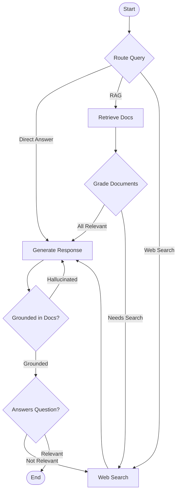

# Advanced RAG Agent (LangGraph)

This folder contains a complete, runnable implementation of an **Advanced RAG (Retrieval-Augmented Generation)** agent built with **LangGraph**.

It combines three state-of-the-art RAG architecture patterns:
1. **Adaptive RAG**: Dynamically routes user queries to the most appropriate node (Vector Store Retrieval, Web Search, or direct answering).
2. **Corrective RAG (CRAG)**: Grades retrieved documents for relevance. If documents are insufficient or irrelevant, it falls back to Web Search to fetch supplementary context.
3. **Self-RAG**: Evaluates the generated response for:
   - **Hallucinations**: Checking if the response is grounded in the retrieved documents.
   - **Answer Relevance**: Checking if the response directly addresses the user's question. If either check fails, the agent loops back to regenerate or search.

## Architecture

The graph flow is structured as follows:



## Features

- **Stateful Workflow**: Built using LangGraph's `StateGraph`, maintaining query, context, and grading state.
- **Local Vector Store**: Uses FAISS loaded with sample documentation (about a mock software "CloudSync Pro") for local RAG execution.
- **Grader Nodes**: Employs structured JSON outputs from LLMs to perform binary document grading, hallucination detection, and answer evaluation.
- **Web Search Fallback**: Automatically integrates search results (using Tavily Search or a fallback search simulator) when local documents lack enough relevant information.

## Quick Start

### 1. Installation
Install dependencies:
```bash
pip install -r requirements.txt
```

### 2. Set Up Environment Variables
Create a `.env` file in this directory (using `.env.example` as a template):
```bash
OPENAI_API_KEY=your_openai_api_key_here
TAVILY_API_KEY=your_tavily_api_key_here # Optional
```

### 3. Run the Agent
Run the script:
```bash
# Query that routes to RAG (local vector store info)
python agent.py --query "What is the storage limit for CloudSync Pro subscription?"

# Query that routes to Web Search (external info)
python agent.py --query "What is the latest release date of Python 3.12?"

# Query that routes to Direct Answering (no search/RAG needed)
python agent.py --query "Explain the concept of recursion in programming."
```
