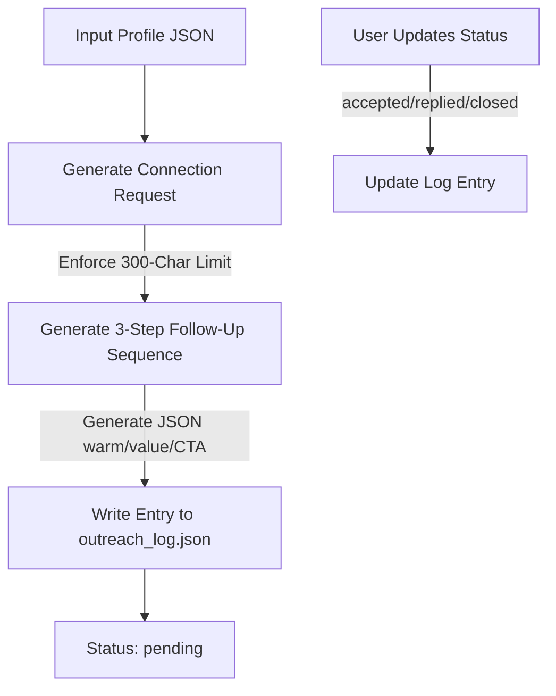

# 🤖 LinkedIn Outreach Agent

[](https://www.python.org/)
[](https://www.anthropic.com/)
[](LICENSE)
[](tests/)

An intelligent, context-aware AI agent that generates highly personalized LinkedIn connection requests and multi-step follow-up sequences using Claude. The agent avoids generic templates, tailoring every outreach to the prospect's background, and maintains state in a local tracking log.

---

## 📋 Table of Contents

- [How It Works](#-how-it-works)
- [Key Features](#-key-features)
- [Quick Start](#-quick-start)
  - [Using pip (Traditional Method)](#using-pip-traditional-method)
  - [Using uv (Recommended Modern Method)](#using-uv-recommended-modern-method)
- [Configuration](#%EF%B8%8F-configuration)
- [Usage in Code](#-usage-in-code)
- [Testing](#-testing)
- [Ethical Considerations & Best Practices](#-ethical-considerations--best-practices)
- [Security & Data Safety](#-security--data-safety)

---

## ⚙️ How It Works

The LinkedIn Outreach Agent follows a structured pipeline from initial profile ingestion to status tracking:



1. **Personalized Connection Note**: Generates a custom invitation under LinkedIn's strict **300-character limit**. It leverages the prospect's title, company, and mutual interests without using generic, spammy templates.
2. **Dynamic Follow-Up Sequence**: Drafts a structured 3-stage follow-up funnel in JSON format:
   - **Step 1: Warm Opener** (sent after connection approval)
   - **Step 2: Value-Add** (sharing relevant resources or insights)
   - **Step 3: Soft CTA** (suggesting a brief discussion or partnership)
3. **Outreach Logging**: Logs all actions locally to `outreach_log.json` to keep track of conversations, statuses, and response metrics.

---

## 🌟 Key Features

| Feature | Description | Benefits |
| :--- | :--- | :--- |
| **No Templates** | Each message is custom-built by Claude from scratch based on profile context. | Maximizes conversion rates by avoiding obvious automation patterns. |
| **Strict Boundary Control** | Automatic character-truncation at 300 characters for connection invites. | Prevents sending failed or cut-off connection notes. |
| **State Management** | Tracking statuses (`pending`, `accepted`, `replied`, `closed`) locally. | Simple pipeline monitoring without database overhead. |
| **Zero-Cost Mocking** | A robust test suite with fully mocked Anthropic API calls. | Instant CI validation without wasting tokens or needing API keys. |

---

## 🚀 Quick Start

### Using pip (Traditional Method)

1. **Clone the repository** and navigate to the agent folder:
   ```bash
   cd linkedin-outreach-agent
   ```

2. **Install dependencies**:
   ```bash
   pip install -r requirements.txt
   ```

3. **Configure Environment Variables**:
   ```bash
   cp .env.example .env
   # Open .env and insert your ANTHROPIC_API_KEY
   ```

4. **Run the demo**:
   ```bash
   python run_demo.py
   ```

---

### Using uv (Recommended Modern Method)

[uv](https://github.com/astral-sh/uv) is an extremely fast Python package installer and resolver.

1. **Install uv** (if not already installed):
   ```bash
   pip install uv
   ```

2. **Create and activate a virtual environment**:
   ```bash
   uv venv
   # On macOS/Linux:
   source .venv/bin/activate
   # On Windows (PowerShell):
   .venv\Scripts\Activate.ps1
   ```

3. **Install dependencies**:
   ```bash
   uv pip install -r requirements.txt
   ```

4. **Run the demo**:
   ```bash
   python run_demo.py
   ```

### Expected Demo Output

```text
============================================================
  LinkedIn Outreach Agent — Demo Run
============================================================

[Agent] Building outreach for Priya Sharma @ Accenture...

--- Connection Request (189 chars) ---
Hi Priya, your work on LLM-based enterprise agents at Accenture directly aligns with what I'm building. I'd love to exchange ideas — your recent posts on agent frameworks were really insightful!

--- Follow-up Sequence ---

[STEP1]
Great to connect, Priya! ...

[STEP2]
...

[STEP3]
...
```

---

## 🛠️ Configuration

Configure the environment using the `.env` file in the root of the project:

```env
# Get your API key from console.anthropic.com
ANTHROPIC_API_KEY=your_actual_anthropic_api_key_here
```

---

## 💻 Usage in Code

To integrate the LinkedIn Outreach Agent into your own applications:

```python
from linkedin_outreach_agent import run_outreach, update_status

# Define prospect profile details
profile = {
    "name": "Jane Doe",
    "title": "AI Research Lead",
    "company": "DeepMind",
    "reason": "Shared interest in multi-agent coordination",
    "goal": "discuss open-source agent tooling",
}

# Run pipeline to generate outreach notes and log them
entry = run_outreach(profile)

# Later, update the status once they accept your invite
update_status("Jane Doe", "DeepMind", "accepted")
```

---

## 🧪 Testing

We supply unit and integration tests under the `tests/` directory. These tests mock the Claude API, allowing you to run them instantly with zero network cost and no API key.

To run the tests, use:
```bash
pytest tests/ -v
```

---

## ⚖️ Ethical Considerations & Best Practices

AI agents are meant to augment human interaction, not replace it. Please adhere to the following guidelines:

- **Review Before Sending**: The agent outputs drafts. Always read, adjust, and review the drafts before sending them to build authentic relationships.
- **Do Not Automate Message Delivery**: Do not hook this agent up to automated browser controllers or clickers. LinkedIn's Terms of Service strictly prohibit mass outreach and automated profile scrapers/messengers.
- **Data Protection**: Avoid supplying sensitive personal information to the agent. Stick to publicly available professional profile data.

---

## 🔒 Security & Data Safety

- **No Secret Logging**: The agent loads your API key from the environment and never commits it, logs it, or outputs it to the console.
- **Local Data Only**: All logs (`outreach_log.json`) are stored locally on your machine. This file is added to `.gitignore` by default to ensure you do not commit prospect information or connection histories.
